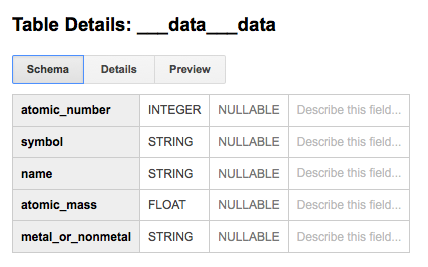
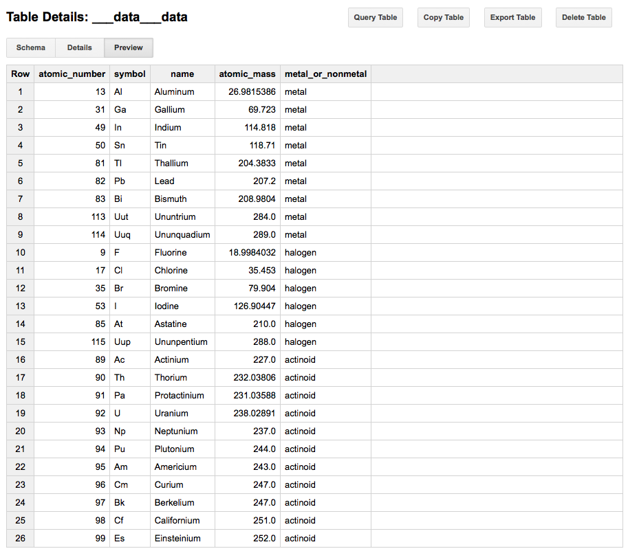
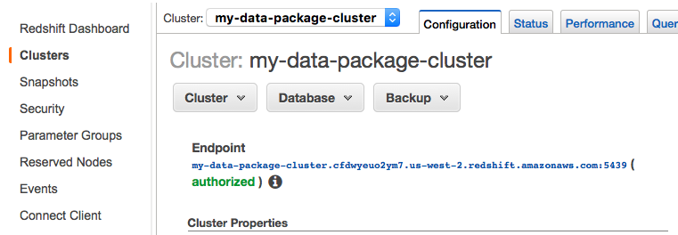

Creating and Using Data Packages in Python
---

*This tutorial will show you how to install the Python library for working with Data Packages and Table Schema, load a CSV file, infer its schema, and write a Tabular Data Package. You will also learn how to work with Tabular Data Packages and see an example of loading a Tabular Data Package from the web and pushing it directly into a local SQL database. Short examples of pushing your dataset to Google’s BigQuery and Amazon’s RedShift follow.*

---


## Setup

For this tutorial, we will need the
[Data Package library](https://github.com/frictionlessdata/datapackage-py)
([PyPI](https://pypi.python.org/pypi/datapackage)) library.

```
pip install datapackage
```

## Creating basic metadata

You can start using the library by importing `datapackage`.

```python
import datapackage
```
The Package() class allows you to work with data packages. Use it to create a blank datapackage called package like so:

```python
package = datapackage.Package()
```
You can then add useful metadata by adding keys to metadata dict attribute.  Below, we are adding the required `name` key as well as a human-readable
`title` key.  For the keys supported, please consult the full
[Data Package spec](/specs/data-package/#metadata).
Note, we will be creating the required `resources` key further down
below.

```python
package.descriptor['name'] = 'period-table'
package.descriptor['title'] = 'Periodic Table'
```

To view your descriptor file at any time, simply type

```python
package.descriptor
```

## Inferring a CSV Schema

Let's say we have a file called `data.csv`
([download](https://github.com/frictionlessdata/example-data-packages/blob/master/periodic-table/data.csv)) in our working
directory that looks like this:

|  atomic number | symbol | name          | atomic mass             | metal or nonmetal?    |
|-------|-------|-------|-------|-------|
|  1             | H      | Hydrogen      | 1.00794                 | nonmetal              |
|  2             | He     | Helium        | 4.002602                | noble gas             |
|  3             | Li     | Lithium       | 6.941                   | alkali metal          |
|  4             | Be     | Beryllium     | 9.012182                | alkaline earth metal  |
|  5             | B      | Boron         | 10.811                  | metalloid             |

We can extrapolate our CSV's [schema](/docs/table-schema/) by
using `infer` from the Table Schema library.  The `infer` function checks a small subset of your dataset and summarizes expected datatypes against each column, etc. To infer a schema for our dataset and view it, we will simply run

```python
package.infer('periodic-table/data.csv')
package.descriptor
```

Where there's need to infer a schema for more than one tabular data resource, use the glob pattern `**/*.csv` instead to infer a schema:

```python
package.infer('**/*.csv')
package.descriptor
```

We are now ready to save our `datapackage.json` file locally. The dp.save() function makes this possible.

```python
dp.save('datapackage.json')
```

The `datapackage.json`
([download](https://github.com/frictionlessdata/example-data-packages/blob/master/periodic-table/datapackage.json)) is
inlined below.  Note that atomic number has been correctly inferred as
an `integer` and atomic mass as a `number` (float) while every other
column is a `string`.

```json
{
  'profile': 'tabular-data-package',
  'resources': [{
    'path': 'data.csv',
    'profile': 'tabular-data-resource',
    'name': 'data',
    'format': 'csv',
    'mediatype': 'text/csv',
    'encoding': 'UTF-8',
    'schema': {
      'fields': [{
          'name': 'atomic number',
          'type': 'integer',
          'format': 'default'
        },
        {
          'name': 'symbol',
          'type': 'string',
          'format': 'default'
        },
        {
          'name': 'name',
          'type': 'string',
          'format': 'default'
        },
        {
          'name': 'atomic mass',
          'type': 'number',
          'format': 'default'
        },
        {
          'name': 'metal or nonmetal?',
          'type': 'string',
          'format': 'default'
        }],
    'missingValues': ['']
    }
  }],
  'name': 'periodic-table',
  'title': 'Periodic Table'
}
```

## Publishing

Now that you have created your Data Package, you might want to
[publish your data online](/docs/publish-online/) so that you can
share it with others.

# More Use Cases:
 
## Reading Basic Metadata

In this case, we are using an example Tabular Data Package containing
the periodic table stored on
[GitHub](https://github.com/frictionlessdata/example-data-packages/tree/master/periodic-table)
([datapackage.json](https://raw.githubusercontent.com/frictionlessdata/example-data-packages/master/periodic-table/datapackage.json),
[data.csv](https://raw.githubusercontent.com/frictionlessdata/example-data-packages/master/periodic-table/data.csv)).
This dataset includes the atomic number, symbol, element name, atomic
mass, and the metallicity of the element.  Here are the first five
rows:

| atomic number | symbol | name      | atomic mass | metal or nonmetal?   |
|---------------|--------|-----------|-------------|----------------------|
| 1             | H      | Hydrogen  | 1.00794     | nonmetal             |
| 2             | He     | Helium    | 4.002602    | noble gas            |
| 3             | Li     | Lithium   | 6.941       | alkali metal         |
| 4             | Be     | Beryllium | 9.012182    | alkaline earth metal |
| 5             | B      | Boron     | 10.811      | metalloid            |

You can start using the library by importing `datapackage`.  Data
Packages can be loaded either from a local path or directly from the
web.

```python
import datapackage
url = 'https://raw.githubusercontent.com/frictionlessdata/example-data-packages/master/periodic-table/datapackage.json'
dp = datapackage.Package(url)
```

At the most basic level, Data Packages provide a standardized format
for general metadata (for example, the dataset title, source, author,
and/or description) about your dataset.  Now that you have loaded this
Data Package, you have access to this metadata using the `metadata`
dict attribute.  Note that these fields are optional and may not be
specified for all Data Packages.  For more information on which fields
are supported, see
[the full Data Package standard][spec-dp].

```python
print(dp.descriptor['title'])
> "Periodic Table"
```

## Reading Data

Now that you have loaded your Data Package, you can read its data.  A
Data Package can contain multiple files which are accessible via the
`resources` attribute.  The `resources` attribute is an array of
objects containing information (e.g. path, schema, description) about
each file in the package.

You can access the data in a given resource in the `resources` array
by reading the `data` attribute.  For example, using our our Periodic
Table Data Package, we can return all elements with an atomic number
of less than 10 by doing the following:

```python
print([e['name'] for e in dp.resources[0].data if int(e['atomic number']) < 10])

> ['Hydrogen', 'Helium', 'Lithium', 'Beryllium', 'Boron', 'Carbon', 'Nitrogen', 'Oxygen', 'Fluorine']
```

If you don't want to load all data in memory at once, you can lazily
access the data using the `iter()` method on the resource:

```python
rows = dp.resources[0].iter()
rows.next()

> {'metal or nonmetal?': 'nonmetal', 'symbol': 'H', 'name': 'Hydrogen', 'atomic mass': '1.00794', 'atomic number': '1'}

rows.next()

> {'metal or nonmetal?': 'noble gas', 'symbol': 'He', 'name': 'Helium', 'atomic mass': '4.002602', 'atomic number': '2'}

rows.next()

> {'metal or nonmetal?': 'alkali metal', 'symbol': 'Li', 'name': 'Lithium', 'atomic mass': '6.941', 'atomic number': '3'}
```

## Loading into an SQL database

[Tabular Data Packages](/specs/tabular-data-package/) contains schema information about its
data using [Table Schema](/specs/table-schema/). This means you can easily import
your Data Package into the SQL backend of your choice. In this case,
we are creating an [SQLite](http://sqlite.org/) database in a new file
named `datapackage.db`.

To load the data into SQL we will need the Table Schema SQL Storage library:

<https://github.com/frictionlessdata/tableschema-sql-py>

You can install it by doing:

```bash
pip install tableschema-sql
```

Now you can load your data as follows:

```python
# create the database connection (using SQLAlchemy)
from sqlalchemy import create_engine

# Load and save table to SQL
engine = create_engine('sqlite:///periodic-table-datapackage.db')
dp.save(storage='sql', engine=engine)

```

One way to check if your data has been saved successfully is by running

```Python
list(engine.execute('SELECT * from data'))
```

Alternatively, if you have `sqlite3` installed, you can inspect and play with your
newly created database.  Note that column type information has been
translated from the Table Schema format to native SQLite types:

```sql
$ sqlite3 periodic-table-datapackage.db
SQLite version 3.19.3 2017-06-27 16:48:08
Enter ".help" for usage hints.

/*check database schema*/

sqlite> .schema
CREATE TABLE data (
  "atomic number" INTEGER,
  symbol TEXT,
  name TEXT,
  "atomic mass" FLOAT,
  "metal or nonmetal?" TEXT
);

/*view all records in the data table*/

SELECT * from data;

```


## Loading into BigQuery

Loading into BigQuery requires some setup on Google's infrastructure,
but once that is completed, loading data can be just as frictionless.
Here are the steps to follow:

1. Create a new project - [link](https://console.cloud.google.com/iam-admin/projects)
2. Create a new service account key - [link](https://console.developers.google.com/apis/credentials)
3. Download credentials as JSON and save as `.credentials.json`
4. Create dataset for your project - [link](https://bigquery.cloud.google.com/welcome/) (e.g. "dataset")

To load the data into BigQuery using Python, we will need the Table Schema BigQuery Storage library:

<https://github.com/frictionlessdata/tableschema-bigquery-py>

You can install it as follows:

```bash
pip install tableschema-bigquery
```

The code snippet below should be enough to push your dataset into the cloud!

```python
import io
import os
import json
from tableschema import Table
from apiclient.discovery import build
from oauth2client.client import GoogleCredentials

# Prepare BigQuery credentials
os.environ['GOOGLE_APPLICATION_CREDENTIALS'] = 'dp-py/credentials.json'
credentials = GoogleCredentials.get_application_default()
service = build('bigquery', 'v2', credentials=credentials)
project = json.load(io.open('credentials.json', encoding='UTF-8'))['project_id']

# Load and save table to BigQuery
table = Table('data.csv', schema='schema.json')
table.save('data', storage='bigquery', service=service, project=project, dataset='dataset')
```

If everything is in place, you should now be able to inspect your
dataset on BigQuery.





## Loading into Amazon RedShift

Similar to Google's BigQuery, Amazon RedShift requires
[some setup](http://docs.aws.amazon.com/redshift/latest/gsg/getting-started.html)
on AWS. Once you've created your cluster, however, all you need to do
is use your cluster endpoint to create a connection string for
SQLAlchemy.

! Note: using the [sqlalchemy-redshift dialect](https://sqlalchemy-redshift.readthedocs.io/en/latest/index.html)
is optional as the `postgres://` dialect is sufficient to load your
table into AWS RedShift.



```python
# create the database connection (using SQLAlchemy)
REDSHIFT_URL = 'postgres://<user>:<pass>@<host>.redshift.amazonaws.com:5439/<database>'
from sqlalchemy import create_engine

# load and save table to RedShift
engine = create_engine(REDSHIFT_URL)
dp.save(storage='sql', engine=engine)

# check if data has been saved successfully
list(engine.execute('SELECT * from data'))))
```